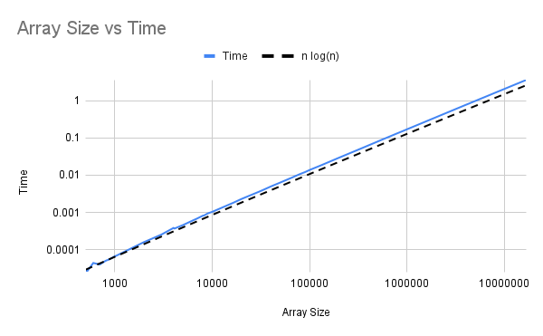
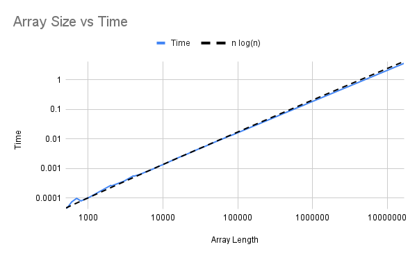
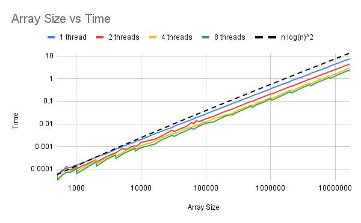
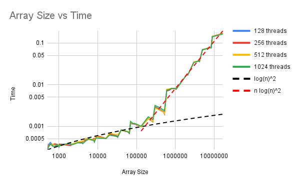
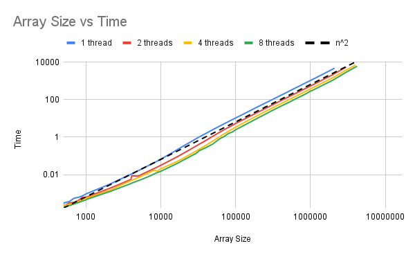
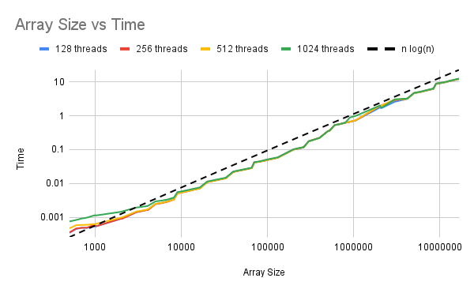
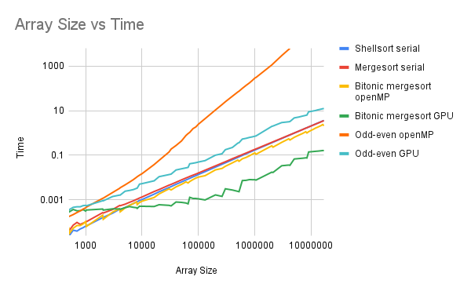

# 392 Final Project Analysis

## Procedure

We timed the sorting algorithm on lists from length 500 to length 16777216 ($2^{24}$). We used each of the sorting methods listed below, and for the parallel versions tested different number of threads.

## Shellsort Serial

The serial shellsort algorithm, using the [Ciura Gap Sequence](https://web.archive.org/web/20180923235211/http://sun.aei.polsl.pl/~mciura/publikacje/shellsort.pdf), has an average runtime on the order of $O(n \log n)$. Our runtimes approximately matched the $n \log n$ time complexity, as seen in the graph below.

## Mergesort Serial

Mergesort has an average runtime of $O(n \log n)$, which we achieved with our implementation as seen below.

## Bitonic Mergesort Shared Memory

Bitonic mergesort has a parallel runtime of $O(\log ^2 (n))$, assuming an arbitrarily large number of threads in use. We used at most 8 threads, so our actual time complexity was closer to $O(n \log ^2 (n))$. The graph is shown below.

## Bitonic Mergesort GPU

On the GPU, we were closer to the $O(\log ^2 (n))$ runtime because we were able to use many more threads, up to 1024 threads per block. We had the optimal runtime for array sizes of up to $2^{17}$, and then the runtime changed to approximately $O(n \log ^2 (n))$.

The flat sections and peaks in the graph are a result of the fact that the algorithm only works for arrays with length a power of two, so we filled arrays with infinity to the next power of two before sorting.

## Odd-Even Sort Shared Memory

With an arbitrarily large number of threads, the odd-even sort has $O(\log ^2 (n))$ parallel runtime. With a limited number of threads, the runtime is $O(n^2)$, which is what we found in our implementation.

For this version, we did not time all the sizes up to $2^{24}$ because the runtimes were already approaching 2 hours, and it was clear that this algorithm was very inefficient compared to the other algorithms.

## Odd-Even Sort GPU

Using more threads, we were able to improve on the $O(n^2)$ time to approximately an $O(n \log(n))$ runtime. Because communication across blocks is very difficult, we did the odd-even sort within a block, and then merged all the blocks together with a GPU version of the mergesort algorithm. Because mergesort is $O(n \log(n))$, that was the limiting factor of our runtime, and we were occasionally a bit faster because the initial sorting was done on the GPU.

## Comparison of all algorithms, and cross-over points

The following table summarizes the cross over points. Each row-column entry shows the array sizes at which the row outperforms the column.

- |Shellsort|Mergesort|Bitonic Shared|Odd-Even Shared|Bitonic GPU| Odd-Even GPU
-|-|-|-|-|-|-
Shellsort|-|500-8,388,608 ($2^{23}$)|500-4,096|500-16,777,216|500-4,096|500-16,777,216
Mergesort|10,000,000-16,777,216 ($2^{24}$)|-|500|500-16,777,216|500-3,000|500-16,777,216
Bitonic Shared|5,000-16,777,216|512-16,777,216|-|500-16,777,216|500-5,000|500-16,777,216
Odd-Even Shared|Never|Never|Never|-|500-800|500-1,024
Bitonic GPU|5,000-16,777,216|4,000-16,777,216|6,000-16,777,216|900-16,777,216|-|500-16,777,216
Odd-Even GPU|Never|Never|Never|2,000-16,777,216|Never|-

